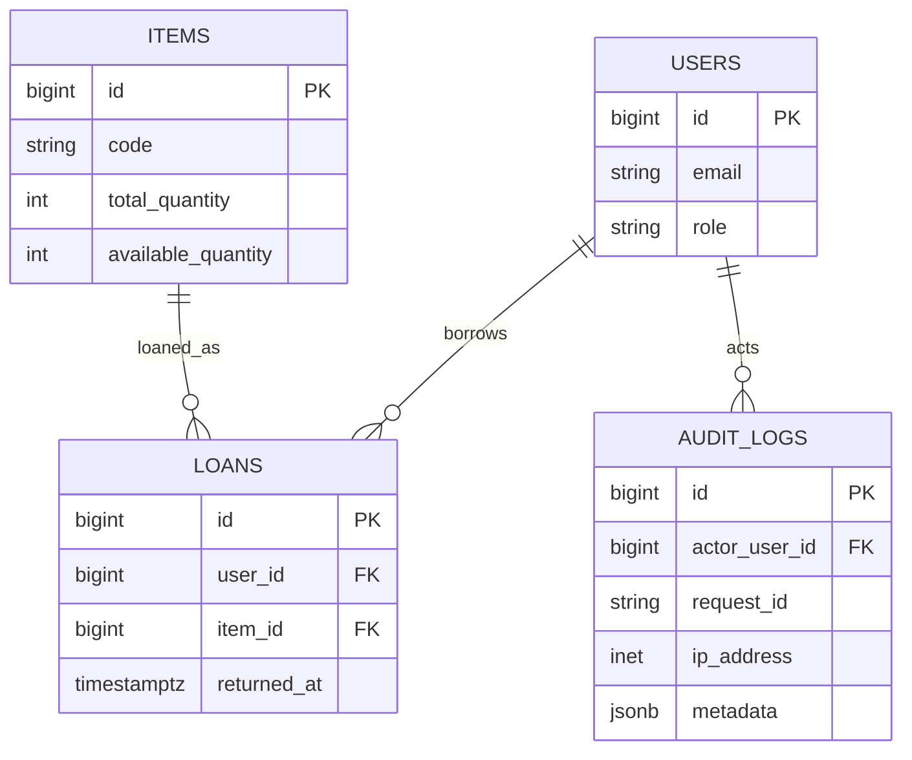

# PostgreSQL DB 설계

## 핵심 관계

`users 1─N loans N─1 items`, `users 1─N audit_logs`. 세션은 `user_sessions`에 저장한다.

| 테이블 | 핵심 컬럼 | 제약/인덱스 |
|---|---|---|
| users | email, password_hash, display_name, role, status, failed_count, locked_until | email UQ, role/status CHECK |
| items | code, name, category, total_quantity, available_quantity, min_quantity, status | code UQ, 수량 CHECK, 검색 인덱스 |
| loans | user_id, item_id, quantity, loaned_at, due_at, returned_at, return_condition | FK, quantity > 0, 활성 조회 인덱스 |
| audit_logs | actor_user_id, action, entity_type/id, metadata, request_id, ip_address, created_at | actor/created·request 인덱스 |
| user_sessions | sid, sess, expire | 세션 만료 인덱스 |
| schema_migrations | version, checksum, applied_at | 적용 버전 PK, SQL 변조 탐지 |
| workflow_requests | organization_id, request_type, requester_id, status, title, reason, payload JSONB | 유형·상태 CHECK, 구매 필드는 Service 정규화 후 매개변수 저장 |
| purchase_orders | organization_id, request_id, order_no, status, total_amount | 요청당 1건 UQ, 조직·발주번호 UQ, 상태·금액 CHECK |
| receipts | purchase_order_id, quantity, status, received_by | quantity > 0, 발주 FK 인덱스, 상태 CHECK |
| inspections | receipt_id, asset_id, result, inspected_by | 입고당 1건 UQ, 결과 CHECK |
| inspection_assets | inspection_id, asset_id, unit_no | 검수·순번 PK, 자산 UQ, FK 인덱스 |
| departments | organization_id, parent_id, unit_type, code, cost_center | 조직별 코드 UQ, 4개 유형 CHECK, 부모·조직 FK 인덱스 |
| user_invitations | organization_id, department_id, email, role, scope_type, token_hash, expires/accepted/revoked_at | 해시 UQ, 미처리 이메일 부분 UQ, 역할·범위·상태 CHECK, FK 인덱스 |

DDL 원본은 `db/migrations/001_init.sql`, 감사 추적 보완은 `002_audit_trace.sql`, 샘플 비품은 `db/seeds/001_items.sql`에 둔다. 앱 시작 시 advisory lock 아래 파일명 순서대로 미적용 migration만 트랜잭션 적용하며, 이미 적용된 파일의 SHA-256이 달라지면 시작을 중단한다.

FR-025는 요청 유형별 확장 필드를 위한 기존 `payload JSONB NOT NULL`을 사용한다. `estimatedAmount`는 소수 둘째 자리 문자열, `quantity`는 정수, `neededAt`은 `YYYY-MM-DD`로 정규화한다. FR-026/027은 기존 migration을 수정하지 않고 `004_procurement_inspection_assets.sql`에서 요청당 발주·입고당 검수 유일 인덱스와 `inspection_assets` 추적 테이블을 추가한다. FR-001/002는 `005_organization_invitations.sql`에서 조직 유형과 초대 수명주기·FK 인덱스를 추가한다. FR-009/016은 `006_reference_data_lifecycle.sql`에서 유형·모델·업체의 활성 상태와 생성·수정 시각을 보완하고, `007_asset_status_reason_reference.sql`에서 상태·사유 정책과 상태 이력 사유 FK·활성 부분 인덱스를 추가한다. 현재 필수 테이블은 30개, migration은 7개다.

구매 추적 관계는 `workflow_requests 1─0..1 purchase_orders 1─N receipts 1─0..1 inspections 1─N inspection_assets N─1 assets`다.

