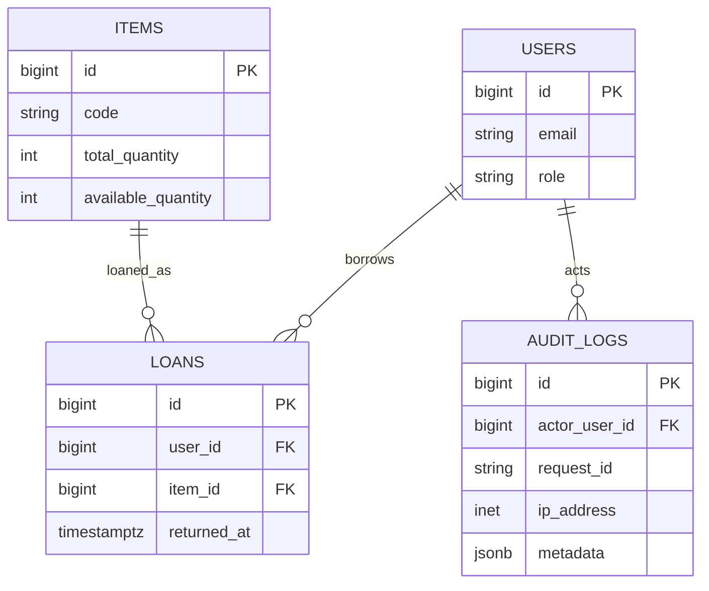

# PostgreSQL DB 설계

## 핵심 관계

`users 1─N loans N─1 items`, `users 1─N audit_logs`. 세션은 `user_sessions`에 저장한다.

| 테이블 | 핵심 컬럼 | 제약/인덱스 |
|---|---|---|
| users | email, password_hash, display_name, role, status, failed_count, locked_until | email UQ, role/status CHECK |
| items | code, name, category, total_quantity, available_quantity, min_quantity, status | code UQ, 수량 CHECK, 검색 인덱스 |
| loans | user_id, item_id, quantity, loaned_at, due_at, returned_at, return_condition | FK, quantity > 0, 활성 조회 인덱스 |
| audit_logs | actor_user_id, action, entity_type/id, metadata, request_id, ip_address, created_at | actor/created·request 인덱스 |
| user_sessions | sid, sess, expire | 세션 만료 인덱스 |
| schema_migrations | version, checksum, applied_at | 적용 버전 PK, SQL 변조 탐지 |

DDL 원본은 `db/migrations/001_init.sql`, 감사 추적 보완은 `002_audit_trace.sql`, 샘플 비품은 `db/seeds/001_items.sql`에 둔다. 앱 시작 시 advisory lock 아래 파일명 순서대로 미적용 migration만 트랜잭션 적용하며, 이미 적용된 파일의 SHA-256이 달라지면 시작을 중단한다.

