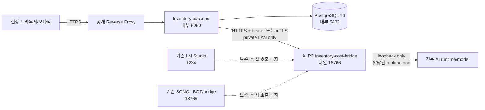

# 사무실 AI PC 격리형 비품관리 브리지 인프라 설계

## 1. 결정 요약

비품관리 시스템은 기존 LM Studio와 SONOL BOT에 직접 붙지 않는다. 백엔드가 호출하는 별도 `inventory-cost-bridge`를 사무실 AI PC에 배치하고, 브리지가 별도의 전용 runtime/model을 호출한다. 기존 LM Studio `1234`, 기존 SONOL BOT/브리지 `18765`는 보존한다. `18766`은 신규 브리지 후보 포트로만 예약하며, 점유 확인과 운영자 승인 전에는 bind하거나 프로세스를 시작하지 않는다.

현재 저장소에서 구현·검증된 애플리케이션 계약은 다음 네 endpoint다.

| Endpoint | 용도 | 준비 조건 |
|---|---|---|
| `GET /health` | 프로세스 생존 확인 | 모델 추론 없이 빠르게 응답 |
| `GET /ready` | runtime·고정 모델·의존성 준비 확인 | 모델 로드와 checksum 검증 후 `200` |
| `POST /recommend` | 유휴 이전·구매·수리·교체 비용 행동 추천 | 조직 ID와 자산 payload 검증 |
| `POST /ocr` | 영수증·자산 증빙 텍스트 구조화 | 조직·자산·파일 식별자와 텍스트 검증 |

외부 AI endpoint는 production에서 HTTPS만 허용한다. 실제 AI PC runtime, 모델, TLS, 인증서, 방화벽, secret가 확인되기 전에는 `AI_PROVIDER_DRIVER=rules`를 유지하고 운영 전환을 `HOLD`한다.

## 2. 목표 토폴로지와 신뢰 경계



- 앱과 AI PC가 같은 장비면 브리지는 `127.0.0.1`에만 bind할 수 있다. 별도 호스트면 고정 사설 IP/내부 DNS(`ai-bridge.office.local`)와 내부 CA 인증서를 사용한다.
- 방화벽 inbound는 백엔드 호스트 또는 backend 컨테이너 네트워크의 source만 허용하고 WAN·일반 사무실 단말은 거부한다. outbound도 필요한 runtime/모니터링 목적지로 제한한다.
- `1234`, `18765`에 대한 stop, 재설정, 모델 이동, proxy 설정 변경은 이 설계의 권한 범위가 아니다. `1235`가 비어 있어도 runtime이 있다고 추정하지 않는다.

## 3. 브리지 계약

### 요청 경계

백엔드는 비품관리 서비스에서 조직 범위를 먼저 검사한 뒤 다음과 같은 도메인 JSON만 전송한다.

```json
{
  "organizationId": "org-uuid",
  "query": "노트북이 필요한 부산 현장의 유휴 자산",
  "assets": [{"id":"asset-uuid","status":"AVAILABLE","locationId":"loc-uuid","acquisitionCost":1200000}]
}
```

OCR은 원본 파일이나 secret를 보내지 않고 `organizationId`, `assetId`, `fileId`, 정규화된 `text`만 전달한다. 브리지는 타 조직 ID를 조회하거나 응답에 포함하지 않는다. 응답은 OpenAI Chat Completions envelope가 아니라 직접 도메인 JSON이다.

```json
{
  "provider": "office-ai-bridge",
  "modelVersion": "cost-control-v1@sha256:...",
  "recommendations": [{"action":"TRANSFER","assetId":"asset-uuid","estimatedCost":30000,"reason":"..."}],
  "usage": {"inputTokens": 0, "outputTokens": 0}
}
```

실패 시 HTTP status와 안전한 `code`만 반환하고 prompt·파일·토큰을 echo하지 않는다. 백엔드는 timeout, 5xx, readiness 실패를 rules fallback으로 전환하고 감사 이벤트에 provider/model version·fallback 사유만 저장한다.

## 4. AI PC Windows 운영 설계

1. `inventory-cost-bridge`와 전용 runtime은 기존 봇과 다른 폴더·서비스 계정·구성 파일을 사용한다. 계정은 비관리자이며 모델 파일과 설정 ACL은 해당 계정과 운영 그룹만 읽는다.
2. Windows Service 또는 Task Scheduler(부팅 후 지연 시작, 자동 재시작, 최대 재시작 횟수)를 사용한다. 운영자는 설치 전 `Get-NetTCPConnection`, 프로세스 경로, 파일 checksum을 기록하고 기존 PID를 종료하지 않는다.
3. 브리지는 제안 포트 `18766`을 bind하기 전에 충돌을 fail-closed한다. runtime listener 포트는 별도 할당 값이며 `1235`를 자동 사용하지 않는다. 모든 포트는 localhost/사설망 범위를 명시한다.
4. `/health`는 liveness, `/ready`는 모델 로드·checksum·runtime 연결·secret 검증까지 반영한다. ready가 아니면 백엔드는 외부 provider를 활성화하지 않는다.
5. 로그는 요청 ID, 상태, 지연, 모델 버전, fallback 횟수만 구조화한다. 자산 설명·OCR 텍스트·토큰·Authorization 헤더는 마스킹하거나 기록하지 않는다. 보존 기간과 접근 감사는 회사 표준에 따른다.

## 5. TLS·인증·시크릿

- production 앱 설정의 네 URL(`AI_PROVIDER_URL`, `AI_PROVIDER_OCR_URL`, `AI_PROVIDER_HEALTH_URL`, `AI_PROVIDER_READY_URL`)은 HTTPS여야 한다.
- 같은 사설망이라도 평문 HTTP를 운영 계약으로 허용하지 않는다. 내부 CA 인증서 검증을 기본으로 하고, 가능한 경우 backend↔bridge mTLS를 사용한다. bearer를 쓸 때는 `AI_PROVIDER_API_KEY_FILE` 또는 컨테이너 secret 파일에서만 읽으며 코드·`.env`·로그에는 남기지 않는다.
- bridge secret는 Windows DPAPI/자격 증명 저장소 또는 ACL 보호 파일로 관리한다. 교체 시 구 secret과 신 secret의 만료 시간을 정하고, 애플리케이션 재시작 없이 가능한지 확인한다.
- 인증 실패·조직 범위 위반·ready 실패는 401/403/503으로 명확히 구분하고 자동 재시도하지 않는다.

## 6. 성능·안정성·비용 제어

- 기본 timeout은 12초(환경변수로 1~120초 범위)이며 bridge는 upstream timeout보다 짧거나 같은 값을 사용한다.
- bridge에 동시성 상한, 요청 크기 상한, 조직별 rate limit, circuit breaker를 둔다. queue가 쌓이면 429/503과 retry-after만 반환한다.
- rules fallback은 추천 품질을 보장하는 AI 대체가 아니라 안전한 업무 지속 모드다. fallback 비율·p95·5xx·모델 버전을 모니터링하고 임계치 초과 시 외부 provider를 자동 차단한다.
- AI 응답은 구매·이전 실행의 권한을 직접 부여하지 않는다. 모든 추천은 기존 승인 workflow와 사용자의 명시적 확인을 통과해야 한다.

## 7. 설치·전환 게이트

| Gate | 증거 | 판정 |
|---|---|---|
| G0 읽기 전용 발견 | 기존 PID/포트/프로세스 경로와 소유자 | 기존 서비스 보존 |
| G1 runtime 승인 | 독립 runtime 명령, 모델 파일 checksum, 라이선스 | AI PC 운영자 승인 필요 |
| G2 네트워크 | bridge listener, source allowlist, 내부 DNS, TLS 체인 | backend에서만 접근 |
| G3 계약 | health/ready 200, recommend/ocr schema, 인증·조직 경계 테스트 | 모든 endpoint 통과 |
| G4 운영성 | 자동 재시작, 로그 마스킹, 메트릭, backup/restore, rollback | 운영 런북 서명 |
| G5 파일럿 | 관리자·현장 역할별 UAT, AI 추천 승인/거부·fallback·감사 | 업무 책임자 승인 |
| G6 전환 | manifest, secret reference, 모니터링·온콜·rollback 승인 | Production GO |

G1~G5의 실제 증거가 없으면 G6는 `HOLD`다. 현재는 G0 문서 발견만 있고 G1 이후는 미충족이다.

## 8. 롤백과 장애 대응

1. bridge ready/health 실패, 5xx 또는 p95 임계치 초과 시 애플리케이션 설정을 `AI_PROVIDER_DRIVER=rules`로 되돌리고 전환 이벤트를 감사 로그에 남긴다.
2. 브리지 설정·모델 checksum·인증서가 마지막 승인 버전과 다르면 service를 재시작하지 말고 격리 후 운영자에게 보고한다.
3. 기존 LM Studio/SONOL BOT에는 장애 대응 목적으로 접근하지 않는다. 브리지 자체의 service stop이 필요한 경우에도 대상 PID·서비스 이름을 확인하고 AI PC 운영자의 별도 승인을 받는다.
4. 복구 후 health→ready→계약 테스트→파일럿 순서로 재검증한다. 실제 실행하지 않은 복구는 완료로 기록하지 않는다.

## 9. 현재 판정

로컬 앱 계약·환경변수·manifest gate·preflight·unit/UI 검증은 통과했다. 그러나 이 세션은 AI PC에 독립 runtime을 설치하거나 실행할 권한·접근 경로가 없고, 기존 `1234`·`18765`를 변경하지 않는 조건이므로 실제 브리지 활성화는 `HOLD`다. 다음 READY는 AI PC 운영자가 G1~G3의 비밀 없는 증거(프로세스/포트, model checksum, health/ready 상태, TLS·인증 방식)를 제공하는 것이다.
