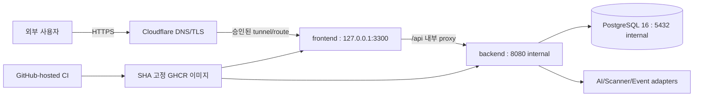

# SQCM-i 비품관리 제품완료 11단계 재검수

검수 시각: 2026-09-03 15:00 KST  
대상: `https://inventory.safe-link.co.kr` 및 `codex/p6-ai-pc-postgres-production`  
판정: **기능·기존 Production 기준선 완료 / 최신 보안패치 기준 10/11 / Production GO 유지 / 장기 운영자격 P7은 7/8 진행 중**

## 1. 핵심 결론

- 단위시험: **915건 중 907 PASS, 0 FAIL, 8 Windows 권한 의존 SKIP**
- 통합시험: **21건 중 20 PASS, 0 FAIL, 1 실제 Defender EICAR 현장시험 SKIP**
- UI 계약: **20/20 PASS**
- 공개 배포 Smoke: `/health`, `/api/health`, `/api/readiness`, 공식 로고 200 및 익명 자산 API 401 **5/5 PASS**
- Production: `frontend`, `backend`, `database` 정확히 3개 컨테이너가 healthy이며 backend/database 호스트 포트는 0개다.
- 의존성: 소스는 `qs`를 6.16.0으로 잠가 `npm audit --omit=dev` **취약점 0건**이다. 현재 실행 중인 불변 이미지는 아직 6.15.3이므로 새 SHA 이미지 배포 전까지 패치 반영 완료로 보지 않는다.
- Harness: 현재 `P7-G1-OPERATIONS-ACTIVATION-AND-SIGNOFF`에 비파괴 verifier를 등록했고 전체 실행 **PASS**다.

8개 Phase의 P7은 제품 기능 부족이 아니라 30일 SLO, 외부 경보 수신, off-site 복원, 온콜 ACK와 최종 운영 인수의 시간·외부 증거를 수집하는 단계다. 이 증거를 임의 생성해 제품완료로 포장하지 않는다.

## 2. 범소프트 웹개발 11단계 체크리스트

| # | 단계 | 상태 | 완료 증거 |
|---:|---|---|---|
| 1 | 프로젝트 목표 | [x] 증거 있는 완료 | `client docs/`, 장기 Goal/Harness에 사용자·업무 변화·범위·성공조건 고정 |
| 2 | 문서 정리 | [x] 증거 있는 완료 | Client/Developer/Agent Docs와 `docs/current-state.md`, `docs/roadmap.md` 분리·연결 |
| 3 | 요구사항 | [x] 증거 있는 완료 | FR 대조표, 정상·실패·권한·데이터·화면·시험 인수조건 연결 |
| 4 | 기능 설계 | [x] 증거 있는 완료 | Browser→Controller→Service→Repository/DB 흐름, 오류·감사·멱등성 계약 존재 |
| 5 | 인프라 설계 | [x] 증거 있는 완료 | local/staging/production 분리, Docker 3서비스, loopback 포트, Cloudflare TLS, Secret·backup·rollback 계약 |
| 6 | DB 설계 | [x] 증거 있는 완료 | PostgreSQL 16, application migration 25/25, 33개 필수 테이블, FK/UNIQUE/이력·트랜잭션 검증 |
| 7 | 화면 설계 | [x] 증거 있는 완료 | 컨셉 11개, HTML Mock, 실제 SPA, 1440/390·390×844 캡처, UI 계약 20/20, API/RBAC 연결 |
| 8 | 기능 개발 | [x] 증거 있는 완료 | 구문 425개, 단위 907 PASS·0 FAIL, 관련 기능·문서·회귀시험 연결 |
| 9 | 배포 | [!] 최신 패치 릴리스 대기 | 기존 불변 `sha-d91d9c3…`는 P6 12/12·공개 smoke·rollback PASS. 이번 `qs 6.16.0`은 새 SHA commit→CI→image→승인 배포가 남음 |
| 10 | 통합 테스트 | [x] 증거 있는 완료 | 실제 PostgreSQL·HTTP·인증·CSRF·RBAC·MFA·파일·업무흐름 20 PASS·0 FAIL |
| 11 | 유지보수 | [x] 제품 인계 게이트 완료 | 유지보수 점검 PASS, 런북·SLO·경보·백업/복구·온콜·개선 큐 실행기와 다음 READY 존재 |

진행률: **기존 배포 제품 11/11 / 최신 보안패치 포함 현재 소스 10/11**

## 3. 화면설계 완료조건

| 항목 | 상태 | 증거/판정 |
|---|---|---|
| 브랜드·디자인 시스템 8요소 | [x] | 공식 로고, 색·컴포넌트·레이아웃 규칙과 밝은/짙은 배경 자산 분리 |
| 정보구조·역할별 메뉴 | [x] | ADMIN·MANAGER·USER 화면/API 권한 계약 |
| 정상·로딩·빈·입력 오류 | [x] | SPA 상태 처리와 UI 계약 검사 |
| 인증 만료·권한·서버/네트워크 오류 | [x] | 401/403/5xx 처리와 화면 상태 연결 |
| 저장 중·성공·중복 제출 | [x] | CSRF와 Idempotency-Key 계약·통합시험 |
| 반응형 | [x] | 1440px 및 390×844, overflow 0의 기존 실제 브라우저 증거 |
| 접근성 | [x] | label·focus·sidebar·logout 회귀 및 UI 계약 |
| 실제 API 연결 | [x] | Docker HTTP와 PostgreSQL 왕복 통합시험 |

기존 실제 화면 증거는 `mock/screenshots/`에 있으며, 이번 Loop에서는 UI 계약과 공개 정적 자산·API 상태를 새로 검증했다. 새 브라우저 캡처를 실행한 것으로 과장하지 않는다.

## 4. 인프라 설계와 현재 배치

- Production Compose는 정확히 `frontend/backend/database` 3서비스다.
- 외부 호스트 공개는 frontend loopback뿐이고 backend/database는 내부 포트만 사용한다.
- local, staging, production DB·Secret·Compose project는 분리한다.
- Production 앱은 시작 시 migration·seed를 수행하지 않으며 forward-only migration을 별도 검증한다.
- SQCM-i 37봇 및 보호 서비스는 배포 대상에 포함하지 않는다.

## 5. 코드에서 운영까지 8단계

| # | 배포 단계 | 상태 | 증거 |
|---:|---|---|---|
| 1 | 코드·릴리스 기준선 | [x] | 배포 release `d91d9c3…`, 현재 문서/검증 HEAD `99dd5e4…`와 원격 일치 |
| 2 | 로컬 품질 | [x] | 구문·단위·통합·UI·audit PASS |
| 3 | 불변 이미지 | [x] | GHCR frontend/backend `sha-d91d9c3…`, container image revision 일치 |
| 4 | GitHub-hosted CI | [x] | quality run `33717469636`, HEAD `99dd5e4…`, conclusion success |
| 5 | 승인 게이트 | [x] | P6 변경창·rollback cutoff·역할 UAT·MFA 서명과 12-Gate actual evidence |
| 6 | 배포 실행 경계 | [x] 승인된 대안 | 별도 self-hosted runner 대신 사용자 승인 AI PC의 project 전용 fail-closed 실행기 사용; CI는 GitHub-hosted로 분리 |
| 7 | Docker 운영·복귀 | [x] | 3서비스 healthy, migration·backup/restore·중지형 rollback·재기동·공개 smoke PASS |
| 8 | 운영 인계·관측 | [x] 제품 인계 준비 | 런북·daily maintenance·TLS·SLO collector·경보/온콜/복구 실행기 존재; 30일 actual 자격은 P7에서 수집 중 |

## 6. 이번 재검수 중 발견·조치

1. 로컬 통합시험 DB에 잔존한 시험 승인정책 1건이 기본 배정 흐름을 가로챘다. 참조 workflow 0건을 확인한 뒤 해당 정책과 감사행 각 1건만 제거했다.
2. 로컬 DB에 application migration 026이 누락돼 25/25로 적용·검증했다.
3. 통합시험을 재실행해 20 PASS·0 FAIL을 확인했다.
4. `qs 6.15.3` 중간등급 advisory를 6.16.0으로 잠금 갱신해 audit 0건으로 만들었다.
5. P7-G1 Harness verifier 누락을 P7 비파괴 운영 검증 봉투에 연결하고 회귀 단위시험을 추가했다.

## 7. Phase 완료 7범주 체크리스트

1. [x] 목표·범위: 제품완료와 30일 운영자격을 분리해 판정했다.
2. [x] 산출물: 사람용 본 문서와 기계증거 JSON을 생성했다.
3. [x] 검증: 단위·통합·UI·공개 smoke·DB·유지보수·audit·Harness를 통과했다.
4. [x] 보안: Secret 원문·개인정보·토큰을 출력·기록하지 않았다.
5. [x] 추적성: 11단계, 화면, 인프라, 배포와 P7 READY를 연결했다.
6. [!] Git·복구: exact allowlist만 변경했고 배포 중 이미지와 rollback 자산은 보존했다. 최신 패치의 commit·CI·불변 이미지·승인 배포가 남았다.
7. [x] 미완료 명시: P7 actual 운영자격은 7/8이며 임의 완료하지 않았다.

## 8. 남은 운영자격 Gate

- 30개 서로 다른 UTC 날짜의 SLO 중 남은 29일
- 외부 경보 5종 실제 수신 receipt
- off-site backup과 격리 restore 실제 증거
- PRIMARY·ESCALATION 온콜 ACK
- GitHub operations queue triage attestation/export
- 운영 책임자 최종 MFA 인수 서명

다음 READY는 `P7-G1-OPERATIONS-ACTIVATION-AND-SIGNOFF`다. 이는 제품 기능 개발의 잔여량이 아니라 운영 증거의 시간·외부 입력 Gate다.

별도 즉시 Gate는 `PATCH-QS-6.16.0-RELEASE-AND-DEPLOY`다. exact allowlist commit·push와 GitHub-hosted CI까지는 기존 P7 준비 권한으로 수행하며, main 병합·새 불변 이미지·Production 교체는 정확한 SHA와 rollback 대상을 제시한 승인 뒤 수행한다.
