# SQCM-i 비품관리 시스템 전체 로드맵

기준일: 2026-08-25

상태 정본: [`docs/current-state.md`](./current-state.md)

장기 실행 상태: [`agent docs/harness/MASTER_ROADMAP.json`](../agent%20docs/harness/MASTER_ROADMAP.json)

로드맵 역할: 전체 진행 순서와 현재 실행 Phase를 한 화면에 고정한다. 과거 `docs/phase-reports/`의 Phase 번호는 역사 증거이며, 새로운 실행 순서를 결정하지 않는다.

## 1. 운영 규칙

1. 한 번에 `진행 중` Phase는 정확히 1개만 둔다.
2. 현재 Phase의 완료 조건과 증거가 모두 충족되기 전에는 다음 Phase를 시작하지 않는다.
3. Phase를 닫을 때 이 문서의 상태·증거·현재 위치를 함께 갱신한다.
4. `승인된 보류`는 실패가 아니라 외부 입력 또는 사용자 승인을 기다리는 상태다.
5. commit·push·배포·운영 변경·Secret·UAT 서명은 별도 승인과 실제 증거 없이는 완료로 바꾸지 않는다.
6. 사용자가 `다음 진행`을 요청하면 아래의 `현재 Phase` 한 건만 수행한다.

상태 표기: `✅ 증거 있는 완료` · `🔄 진행 중` · `⏳ 미착수` · `🔒 승인된 보류` · `⛔ 차단`

## 2. 전체 진행 시각화

```mermaid
flowchart LR
    P0["P0 로컬 제품 기준선<br/>✅ 완료"] --> P1["P1 UI 접근성 안정화<br/>✅ 완료"]
    P1 --> P2["P2 릴리스 기준선·CI<br/>🔄 현재"]
    P2 -->|"commit·push·Draft PR 승인 + CI 증거"| P3["P3 AI PC 연동<br/>🔒 외부 입력"]
    P3 --> P4["P4 Staging 인프라·배포<br/>🔒 외부 입력"]
    P4 --> P5["P5 역할별 UAT<br/>🔒 외부 입력"]
    P5 --> P6["P6 Production 전환<br/>🔒 승인"]
    P6 --> P7["P7 운영·유지보수 활성화<br/>⏳ 대기"]

    classDef done fill:#DCFCE7,stroke:#15803D,color:#14532D,stroke-width:2px;
    classDef active fill:#DBEAFE,stroke:#1D4ED8,color:#1E3A8A,stroke-width:4px;
    classDef pending fill:#F3F4F6,stroke:#6B7280,color:#374151,stroke-width:2px;
    classDef hold fill:#FEF3C7,stroke:#B45309,color:#78350F,stroke-width:2px;
    class P0,P1 done;
    class P2 active;
    class P7 pending;
    class P3,P4,P5,P6 hold;
```

진척도: **2 / 8 Phase 완료**

현재 위치: **P2 릴리스 기준선·CI**

다음 Phase: **P3 AI PC 연동** — P2 종료 전에는 시작하지 않는다.

## 3. 실행 Phase 판정표

| Phase | 범위 | 상태 | 완료 조건 | 현재 증거 또는 차단 입력 |
|---|---|---|---|---|
| P0 로컬 제품 기준선 | 저장소 확보, Wi-Fi 대체 게이트, 로컬 Docker 3계층, DB·API·UI 기본 검증 | ✅ 증거 있는 완료 | 로컬 서비스 healthy, 필수 테스트 PASS, 보호 서비스 보존 | Wi-Fi 사용 가능, Docker 3/3 healthy, 구문 95, 단위 109/109, 통합 20/20 |
| P1 UI 접근성 안정화 | 데스크톱·모바일 메뉴, 로그아웃 접근성, 클릭 차단 회귀 수정 | ✅ 증거 있는 완료 | 변경 diff 검토, UI 계약 16 PASS, 역할별 브라우저 확인, 변경 기준선 확정 승인 | UI 계약 16, 구문 95, 단위 109/109, 통합 20/20 PASS. 1280×720 및 390×844 로그아웃 동작 확인 |
| P2 릴리스 기준선·CI | P1·Harness 변경 commit, Draft PR, 원격 CI, 불변 이미지 기준선 | 🔄 진행 중 | 승인된 commit/push/Draft PR, CI PASS, main 병합 후 정확한 SHA·이미지 digest 기록 | commit `cfed57c…`, Draft PR #22, quality run `32796061921`의 unit·three-tier-integration PASS. main 병합·이미지 승인 필요 |
| P3 AI PC 연동 | 독립 bridge/runtime/model, G1~G5, fallback | 🔒 승인된 보류 | checksum, listener, TLS·인증, health/ready, 계약·rollback PASS | AI PC 주소·운영자·모델 결정 필요. 기존 1234·11434·18765 보존 |
| P4 Staging 인프라·배포 | 전용 hostname, 공급자, Secret reference, PITR, staging 배포 | 🔒 승인된 보류 | backup→migration→불변 이미지→health/smoke→rollback PASS | staging/production 대상과 공급자·접속 권한 필요 |
| P5 역할별 UAT | 19개 UAT와 업무·보안·운영 책임자 검수 | 🔒 승인된 보류 | 19개 PASS, Critical/High 0, 책임자 3명 실제 서명 | 실제 참여자·책임자 지정 필요 |
| P6 Production 전환 | 최종 승인, cutover, 관측·복구 확인 | 🔒 승인된 보류 | P3~P5 PASS, 승인된 변경 시간, cutover·rollback 증거 | 모든 선행 외부 게이트 필요 |
| P7 운영·유지보수 활성화 | 백업, 경보, 온콜, 정기 점검, 개선 큐 | ⏳ 미착수 | 운영 백업·경보 수신·복구훈련과 책임자 인수 | P6 완료 후 시작 |

## 4. 전역지침 11단계 연결

| 전역 단계 | 현재 판정 | 실행 Phase 연결 |
|---|---|---|
| 1 목표 | ✅ 증거 있는 완료 | P0 |
| 2 문서 | ✅ 증거 있는 완료 | P0 및 이 로드맵 |
| 3 요구사항 | ✅ 증거 있는 완료 | P0 |
| 4 기능 | ✅ 증거 있는 완료 | P0 |
| 5 인프라 | 로컬 ✅ / 운영 🔒 | P0, P4 |
| 6 DB | 로컬 ✅ / 운영 🔒 | P0, P4 |
| 7 화면 | ✅ 증거 있는 완료 | P1 |
| 8 개발 | 기준선 ✅ / 릴리스 기준선 🔄 | P2 |
| 9 배포 | 🔒 승인된 보류 | P2, P4, P6 |
| 10 통합 테스트 | 로컬 ✅ / 실사용자 🔒 | P0, P5 |
| 11 유지보수 | 계약 ✅ / 운영 활성화 ⏳ | P7 |

## 5. 현재 Phase 카드 — P2

- 목표: P1·Harness 변경을 승인된 Git 기준선으로 고정하고 원격 CI와 불변 이미지 증거를 연결한다.
- 변경 범위: 정확한 후보 allowlist stage·commit, `origin` 작업 브랜치 push, `main` 대상 Draft PR 생성과 원격 CI 확인.
- 비범위: 외부 AI bridge, staging/production 배포, Secret 생성, UAT 서명.
- 사전 증거: 2026-08-25 Harness strict 8/8, 구문 96 PASS, 단위 109/109 PASS, 통합 20/20 PASS, UI 계약 16 PASS, Compose·Docker 3/3 healthy, smoke·유지보수 PASS. SQCM-i 37봇과 보호 listener 보존.
- 원격 증거: commit `cfed57c62b9416b047f058ce33488cb8d059ec0b`, Draft PR #22, quality workflow run `32796061921`, unit·three-tier-integration 성공.
- 남은 게이트: Draft PR ready 전환·main 병합·main quality·release-images·GHCR digest 확인의 사용자 명시 승인. production 배포는 비범위.
- 이번 Loop의 유일한 READY: **P2 main 병합·릴리스 이미지 승인 확인**.

## 6. Phase 갱신 절차

현재 Phase가 해결될 때만 다음 네 항목을 한 번 갱신한다.

1. 현재 Phase를 `✅ 증거 있는 완료`로 바꾸고 증거 링크 또는 명령 결과를 기록한다.
2. 진척도 분자를 1 올린다.
3. 다음 Phase 하나만 `🔄 진행 중`으로 바꾼다.
4. `docs/current-state.md`의 최신 작업 오버레이와 다음 READY를 같은 사실로 맞춘다.
